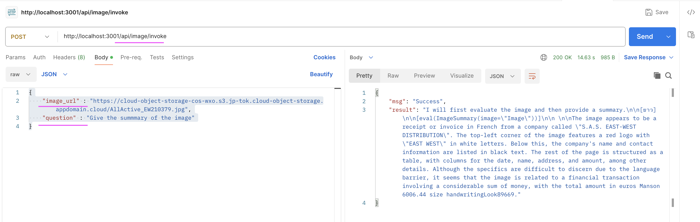
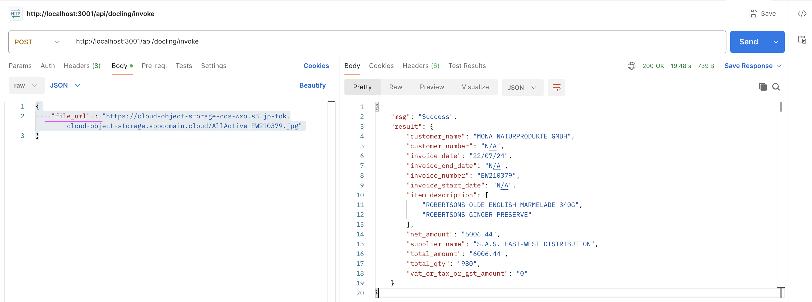

# watsonx.ai Utility Application

This application helps to acccess the LLMs (text), MutliModel LLMs (text and image) and IBM Docling (to process PDF) using the Watsonx.ai. 

The application exposes the below two main APIs to call LMMs via Watsonx.ai.
- http://localhost:3001/api/text/invoke
- http://localhost:3001/api/image/invoke
- http://localhost:3001/api/docling/invoke

If you have Watsonx.ai API Key, you can call those APIs. 

This documentation details about how to run this application.

## Prerequisite

Python 3.x should be installed and available.

## 1. Installation

#### 1.1 Download this repo

1. Download this repo (https://github.com/GandhiCloudLab/watsonx-ai-util-app). 

2. Let's assume the repository has been downloaded, and available in the location `/Users/xyz/watsonx-ai-util-app`.

    Let's call this as a root folder.

    Don't forget to replace the `/Users/xyz/watsonx-ai-util-app` with your folder structure, wherever we refer in this document.

#### 1.2 Create Python virtual environment

1. Open a new command or terminal window.

2. Goto the repository root folder by running the below command.

    **Note:** Don't forget to replace the `/Users/xyz/watsonx-ai-util-app` with your folder structure.

    ```
    cd /Users/xyz/watsonx-ai-util-app
    ```

3. Create python `virtual environment` by running the below command.

    ```
    python -m venv myvenv
    source myvenv/bin/activate
    ```

4. Install the required python packages by running the below command.
    ```
    python -m pip install -r requirements.txt
    ```

#### 1.3 Create .env file

1. Create `.env` file with the below entries (you should be still in the root folder of the repo /Users/xyz/watsonx-ai-with-multimodal-llm )

```
LOGLEVEL = DEBUG

TEMP_FOLDER = "/Users/gandhi/GandhiMain/990-Temp/test"

WATSONX_IBMC_AUTH_URL = "https://iam.cloud.ibm.com/identity/token"
WATSONX_CREDENTIALS_URL = "https://us-south.ml.cloud.ibm.com"
WATSONX_API_URL = "https://us-south.ml.cloud.ibm.com/ml/v1/text/generation?version=2023-05-29"
WATSONX_API_KEY = "xxxxx"
WATSONX_PROJECT_ID = "53302198-522e-49a6-ba45-b445d46db666"
WATSONX_MODEL_ID_DOCLING = "ibm/granite-3-8b-instruct2"
WATSONX_MODEL_ID_IMAGE = "meta-llama/llama-3-2-90b-vision-instruct"
WATSONX_MODEL_ID_TEXT = "ibm/granite-3-8b-instruct"
```

2. Update the `WATSONX_` properties with your data.

3. Update the `TEMP_FOLDER` properties with your temp folder structure. In this folder the  downloaded will be kept.

#### 1.4 Start the Python app

1. Run the below commands to start the app

    ```
    python ./src/main.py
    ```

2. Verify the app is working by opening the url  http://localhost:3001/welcome in your browser. It should return some welcome text.

## 2 Using the API

### 2.1 Invoke Text API 

1. The Text API exposed by this application is http://localhost:3001/api/text/invoke

2. You can post the below json into this API
```
{
    "question" : "What is AI"
}
```

3. Here is the sample Curl script.

```
curl --location 'http://localhost:3001/api/text/invoke' \
--header 'Content-Type: application/json' \
--data '{
     "question" : "What is AI"
}'
```

4. Here is the postman sample
    


### 2.2 Invoke Image API 

1. The Image API exposed by this application is http://localhost:3001/api/image/invoke

2. You can post the below json into this API
```
{
    "image_url" : "https://cloud-object-storage-cos-wxo.s3.jp-tok.cloud-object-storage.appdomain.cloud/AllActive_EW210379.jpg",
    "question" : "What is the total bill amount"
}
```

You can pass your image URL here along with your question about the image.

3. Here is the sample Curl script.

```
curl --location 'http://localhost:3001/api/image/invoke' \
--header 'Content-Type: application/json' \
--data '{
    "image_url" : "https://cloud-object-storage-cos-wxo.s3.jp-tok.cloud-object-storage.appdomain.cloud/AllActive_EW210379.jpg",
    "question" : "Give the summmary of the image"
}'
```

4. Here is the postman sample

    


### 2.3 Invoke Docling API 

1. The Docling API exposed by this application is http://localhost:3001/api/docling/invoke

2. You can post the below json into this API
```
{
    "file_url" : "https://cloud-object-storage-cos-wxo.s3.jp-tok.cloud-object-storage.appdomain.cloud/AllActive_EW210379.jpg"
}
```

You can pass your image URL here along with your question about the image.

3. Here is the sample Curl script.

```
curl --location 'http://localhost:3001/api/docling/invoke' \
--header 'Content-Type: application/json' \
--data '{
    "file_url" : "https://cloud-object-storage-cos-wxo.s3.jp-tok.cloud-object-storage.appdomain.cloud/AllActive_EW210379.jpg"
}'
```

4. Here is the postman sample

    


## 3. Starting the App using Docker / Podman


### 3.1 Starting the App

This document provides instructions on how to start this app using Docker / Podman.

1. In the terminal window, run the below command after replacing the xxxxxxx with Watsonx API Key.

```
export WATSONX_API_KEY=xxxxxxx
```

2. Run the below command start the docker container.

**Mac :**

    ```
    docker run -d -p 3001:3001 --name watsonx-ai-util-app \
        --env LOGLEVEL=DEBUG \
        --env WATSONX_API_KEY=$WATSONX_API_KEY \
        gandigit/watsonx-ai-util-app-mac:latest
    ```

**Linux :**

    ```
    docker run -d -p 3001:3001 --name watsonx-ai-util-app \
        --env LOGLEVEL=DEBUG \
        --env WATSONX_API_KEY=$WATSONX_API_KEY \
        gandigit/watsonx-ai-util-app-linux:latest
    ```
    
- To run the same using `Podman` instead of `Docker`, you need to change the  `docker` into `podman` in the above command.

3. Open this url (http://localhost:3001/welcome) in the browser to see if it is working .

### 3.2 Stop the App (for info only)

Run the below commands one by one to stop the apps.

```
docker stop watsonx-ai-util-app
docker watsonx-ai-util-app

```

### 3.3 View App logs (for info only)

Run the below commmand to view the logs of the apps.

```
docker logs watsonx-ai-util-app

```